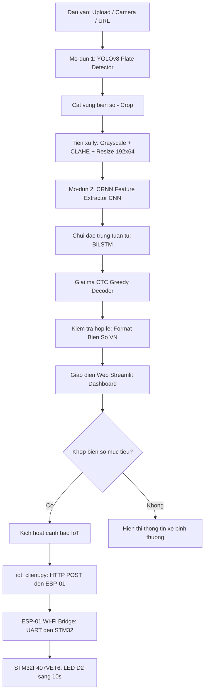
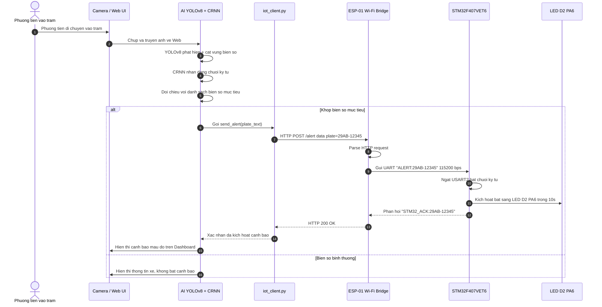
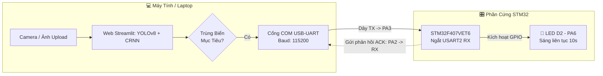
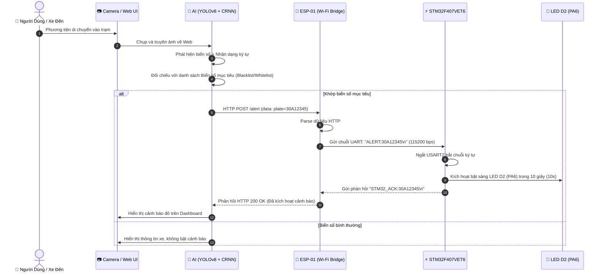

# 🚗 Hệ Thống Nhận Diện Biển Số Xe Việt Nam (ALPR / ANPR)

> **Đồ án môn học:** Nghiên cứu & Xây dựng Hệ thống Tự Động Nhận Diện Biển Số Xe (Automatic License Plate Recognition)  
> **Công nghệ lõi:** `YOLOv8` ⚡ `CRNN (CNN + BiLSTM)` ⚡ `CTC Loss` ⚡ `PyTorch` ⚡ `OpenCV` ⚡ `Streamlit`

---

>  **Link Google Drive tải sản phẩm đóng gói:** (https://drive.google.com/file/d/1X1n2R2iVez5y6WRnL59zJwGNxEA87hab/view?usp=sharing)


## 📌 1. Giới Thiệu & Mục Tiêu Đề Tài

Hệ thống giải quyết bài toán cốt lõi trong **Giao thông thông minh (ITS)** và **Quản lý bãi đỗ xe tự động**: Tự động phát hiện vị trí và đọc chính xác chuỗi ký tự trên biển số xe phương tiện giao thông tại Việt Nam (ô tô, xe máy, biển 1 dòng và biển 2 dòng) trong điều kiện thời gian thực.

Hệ thống được thiết kế theo kiến trúc **End-to-End** gồm 2 mô-đun AI chuyên biệt:
1. **Mô-đun 1 — Phát Hiện Biển Số (Plate Detection):** Sử dụng mạng **YOLOv8** (hoặc giải thuật OpenCV Fallback) để khoanh vùng và cắt chính xác tọa độ biển số, loại bỏ hoàn toàn nhiễu từ thân xe và môi trường xung quanh.
2. **Mô-đun 2 — Nhận Dạng Ký Tự (OCR Recognition):** Ứng dụng mạng **CRNN (Convolutional Recurrent Neural Network)** kết hợp **CTC Loss**, đọc trực tiếp toàn bộ chuỗi ký tự mà không cần bước phân đoạn ký tự (character segmentation) phức tạp.

---

## 🏗️ 2. Kiến Trúc Hệ Thống (System Architecture)

### 🤖 Pipeline AI Nhận Diện Biển Số



### 🔄 Luồng Tích Hợp IoT Đầy Đủ (End-to-End Flow)



### 🔧 Chi Tiết Các Tầng Trong Mạng CRNN

| Tầng | Thành phần | Mô tả |
| :--- | :--- | :--- |
| **CNN** | 7 tầng Conv2D + BatchNorm + ReLU + MaxPool | Trích xuất đặc trưng hình ảnh biển số |
| **Map-to-Seq** | Reshape feature maps thành chuỗi vector | Chuyển đổi sang dạng chuỗi thời gian |
| **BiLSTM** | 2 tầng Bidirectional LSTM (hidden=256) | Học ngữ cảnh 2 chiều trái-phải |
| **CTC Decode** | Linear + CTC Greedy Decode | Giải mã ký tự, loại blank `_` và ký tự trùng |

## 🌟 3. Các Điểm Nổi Bật & Cải Tiến Kỹ Thuật

* **Xử lý mất cân bằng dữ liệu (Class Imbalance):** Tự động áp dụng kỹ thuật **Oversampling** cho các ký tự hiếm hoặc dễ nhầm lẫn (đặc biệt là ký tự `B` so với số `8`), triệt tiêu hiện tượng mô hình thiên vị đoán sang số `8`.
* **Phân chia tập dữ liệu chuẩn 3 phần (70/15/15):** Chia rõ ràng **Train (70%) / Validation (15%) / Test (15%)** độc lập với seed cố định. Tuyệt đối không đánh giá trên tập dữ liệu đã dùng để huấn luyện.
* **Cơ chế sao lưu và so sánh an toàn:** Tự động backup mô hình cũ thành `saved_models/plate_recognizer_backup.pth`. Sau khi huấn luyện, hệ thống tự động so sánh mô hình mới và mô hình cũ trên cùng **Test Set** và chỉ ghi đè mô hình production khi kết quả mới tốt hơn.
* **Xử lý thông minh biển 1 dòng & 2 dòng:** Tự động nhận diện biển vuông (xe máy, xe tải) và biển dài (ô tô), kết hợp song song chiến lược đọc nguyên khối và tách dòng dựa trên phân tích khoảng trống mật độ điểm ảnh.
* **Hậu xử lý chuẩn hóa format VN:** Xác thực định dạng biển số theo chuẩn vị trí mã tỉnh, seri chữ cái và số thứ tự mà không tự ý hoán đổi ký tự khi chưa đủ bằng chứng.

---

## 📊 4. Kết Quả Đánh Giá Thực Nghiệm (Trên Test Set Độc Lập)

Đánh giá toàn diện trên **945 ảnh tập Test độc lập (15% dataset)**:

| Chỉ số đánh giá | Kết quả đạt được | Ý nghĩa thực tế |
| :--- | :---: | :--- |
| **Character Accuracy** | **88.33%** | Tỷ lệ ký tự nhận diện đúng vị trí |
| **Exact Plate Accuracy** | **65.82%** (622/945) | Tỷ lệ biển số đúng hoàn toàn 100% |
| **Character Error Rate (CER)** | **9.69%** | Tỷ lệ khoảng cách chỉnh sửa Levenshtein |
| **Validation Exact Accuracy** | **66.14%** (625/945) | Độ chính xác trên tập kiểm định |
| **Tốc độ suy luận (Inference)** | **~15 - 30 ms / ảnh** | Đáp ứng yêu cầu thời gian thực trên CPU/GPU |

---

## 📁 5. Cấu Trúc Thư Mục Dự Án (Project Structure)

```text
DOAN/
├── app.py                       # Ứng dụng Web Dashboard hoàn chỉnh bằng Streamlit
├── config.py                    # Cấu hình trung tâm (Hyperparameters, Alphabet, Paths)
├── dataset.py                   # Pipeline nạp dữ liệu, chia 70/15/15, Augmentation, Oversample
├── detector.py                  # Thuật toán phát hiện biển số (YOLOv8 & OpenCV)
├── model.py                     # Kiến trúc CRNN PyTorch (CNN + BiLSTM + CTC Decode)
├── train.py                     # Huấn luyện OCR, Early Stopping, Backup & So sánh Test Set
├── train_yolo.py                # Kịch bản huấn luyện YOLOv8 phát hiện biển số
├── evaluate.py                  # Đánh giá độc lập, vẽ biểu đồ lỗi, xuất báo cáo chi tiết
├── iot_client.py                # Module giao tiếp IoT (HTTP → ESP-01 → UART → STM32)
├── launcher.py                  # Entry point đóng gói PyInstaller → BienSoAI.exe
├── BienSoAI.spec                # Cấu hình PyInstaller build (onedir mode)
├── plate_history.json           # Lịch sử nhận dạng biển số (lưu tự động khi chạy)
├── requirements.txt             # Danh sách thư viện phụ thuộc
├── .gitignore                   # Loại trừ cache, build, dist, model backup
├── README.md                    # Tài liệu dự án (file này)
├── PROJECT_INFO_FOR_REPORT.txt  # Thông tin chi tiết dùng cho báo cáo
├── saved_models/                # Thư mục lưu trữ trọng số mô hình
│   ├── plate_recognizer.pth         # Model OCR CRNN chính thức (Production)
│   ├── plate_recognizer_backup.pth  # Model OCR sao lưu dự phòng (Backup)
│   └── yolo_plate_detector.pt       # Model YOLOv8 phát hiện biển số
├── esp01_firmware/              # Firmware Arduino/ESP8266 cho module Wi-Fi ESP-01
│   └── esp01_firmware.ino           # Sketch Arduino: HTTP server + UART bridge → STM32
├── stm32_firmware/              # Firmware C/STM32CubeIDE cho STM32F407VET6
│   ├── main.c                       # Code chính: Ngắt USART2, điều khiển LED D2 sáng 10s
│   ├── main.h                       # Header thư viện HAL STM32
│   ├── canhbaonhandien.ioc          # Cấu hình chân & clock STM32CubeMX
│   └── README.md                    # Hướng dẫn nạp và hoạt động phần cứng STM32
├── results/                     # Kết quả đánh giá và biểu đồ xuất ra
│   ├── evaluation_report.txt        # Báo cáo đánh giá chi tiết
│   ├── char_error_distribution.png  # Biểu đồ phân phối ký tự bị nhầm
│   └── training_history.png         # Biểu đồ quá trình huấn luyện
├── dataset/                     # Thư mục dữ liệu (không gồm yolo_data - ~961MB)
│   ├── labels.csv                   # File nhãn (filename, plate_text)
│   └── plates/                      # Thư mục chứa ảnh biển số (~6300+ ảnh)
└── dist/                        # Thư mục đóng gói phân phối (tạo bởi PyInstaller)
    └── BienSoAI/                    # Ứng dụng standalone đã đóng gói
        ├── BienSoAI.exe                 # File thực thi chính (double-click để chạy)
        └── _internal/                   # Thư mục tài nguyên & môi trường Python nhúng
```

## ⚙️ 6. Hướng Dẫn Cài Đặt & Chạy Hệ Thống

### Bước 1: Cài đặt môi trường
Yêu cầu Python 3.9 trở lên. Cài đặt các thư viện cần thiết:
```bash
pip install -r requirements.txt
```

### Bước 2: Huấn luyện mô hình OCR (Tùy chọn nếu muốn train lại)
Chương trình sẽ tự động chia 3 tập (Train 70% / Val 15% / Test 15%), oversample ký tự `B`, backup model cũ và so sánh trên Test set:
```bash
python train.py
```

### Bước 3: Đánh giá mô hình & Xem thống kê lỗi
Chạy đánh giá toàn diện trên tập Test độc lập:
```bash
# Đánh giá toàn bộ tập Val & Test
python evaluate.py

# Hoặc test riêng một ảnh biển số cụ thể
python evaluate.py --image "path/to/plate_image.jpg"
```

### Bước 4: 🚀 Khởi chạy Giao Diện Web Demo (Streamlit)
Khởi động giao diện Web tương tác trực quan:
```bash
streamlit run app.py
```
Mở trình duyệt truy cập: **`http://localhost:8501`** (hoặc port được hiển thị trên Terminal).

### Bước 5: 🔌 Cấu Hình, Nạp Code & Kết Nối Phần Cứng IoT (ESP-01 + STM32F407VET6)

Hệ thống tích hợp đầy đủ phân hệ phần cứng cảnh báo nhận diện biển số xe mục tiêu. Dưới đây là hướng dẫn chi tiết từ nạp firmware, đấu nối chân đến vận hành:

#### 5.1. Nạp Firmware Cho Module Wi-Fi ESP-01 (ESP8266)
1. Khởi động phần mềm **Arduino IDE**, mở file mã nguồn [`esp01_firmware/esp01_firmware.ino`](esp01_firmware/esp01_firmware.ino).
2. Vào **Tools -> Board -> Boards Manager**, tìm kiếm và cài đặt gói bo mạch `esp8266` (bởi *ESP8266 Community*).
3. Thiết lập thông số Wi-Fi trong code khớp chính xác với mạng Wi-Fi hoặc Windows Mobile Hotspot máy tính:
   ```cpp
   const char* WIFI_SSID     = "DUAN_IOT";    // Tên trạm Wi-Fi / Hotspot phát ra
   const char* WIFI_PASSWORD = "1234567890";   // Mật khẩu kết nối Wi-Fi
   ```
4. Cắm ESP-01 vào mạch nạp (USB to ESP-01 Programmer hoặc module USB-UART FTDI ở chế độ nạp Flash: chân GPIO0 nối GND).
5. Chọn đúng cổng COM trong mục **Tools -> Port**, chọn Board **Generic ESP8266 Module** và nhấn **Upload**.
6. Sau khi nạp hoàn tất, tháo chân GPIO0 khỏi GND, mở Serial Monitor (Baudrate `115200`) để quan sát địa chỉ IP được cấp phát (ví dụ: `192.168.137.61`).

#### 5.2. Nạp Firmware Cho Vi Điều Khiển STM32F407VET6
1. Khởi động phần mềm **STM32CubeIDE**, mở thư mục dự án [`stm32_firmware/`](stm32_firmware/).
2. Các thông số phần cứng được cấu hình chuẩn xác trong [`canhbaonhandien.ioc`](stm32_firmware/canhbaonhandien.ioc):
   - **Xung nhịp hệ thống (Clock):** 168 MHz (sử dụng thạch anh ngoài HSE 8MHz).
   - **UART giao tiếp (USART2):** Chân `PA2` (TX), `PA3` (RX) tốc độ `115200 bps`, kích hoạt ngắt nhận `HAL_UART_Receive_IT`.
   - **GPIO điều khiển LED D2:** Chân `PA6`, cấu hình Output Push-Pull, Active LOW (Mức 0V = Sáng, Mức 3.3V = Tắt).
   - **Thời gian giữ sáng:** Được định nghĩa `#define LED_ON_DURATION 10000` (10 giây) trong [`main.c`](stm32_firmware/main.c).
3. Kết nối mạch nạp **ST-Link v2** vào cổng SWD của bo STM32F407VET6 (4 dây: 3.3V, GND, SWDIO, SWCLK).
4. Nhấn tổ hợp phím **Ctrl + F11** (hoặc chọn *Run -> Run*) để biên dịch và nạp firmware vào vi điều khiển.
5. Khi nạp thành công, LED D2 sẽ nháy nhanh 3 lần xác nhận phần cứng sẵn sàng, sau đó tắt hẳn để chờ lệnh từ AI Web.

#### 5.3. Sơ Đồ Đấu Nối Dây Phần Cứng (ESP-01 ➔ STM32F407VET6)
Kết nối 5 đường tín hiệu chính giữa module ESP-01 và bo mạch STM32:

| Chân ESP-01 (ESP8266) | Chân STM32F407VET6 | Chức Năng / Ghi Chú |
| :--- | :--- | :--- |
| **TXD** | **PA3 (USART2_RX)** | Truyền chuỗi lệnh `ALERT:<plate>\n` từ ESP-01 sang STM32 |
| **RXD** | **PA2 (USART2_TX)** | Nhận chuỗi phản hồi `STM32_ACK:<plate>\n` từ STM32 |
| **GND** | **GND** | Nối chung Mass (Bắt buộc để đồng pha tín hiệu logic UART) |
| **3V3 (VCC)** | **3.3V (Nguồn)** | Cấp nguồn 3.3V ổn định (dòng tiêu thụ tối thiểu ≥ 300mA) |
| **EN (CH_PD)** | **3.3V** | Kéo lên mức Cao 3.3V để kích hoạt vi điều khiển ESP8266 |

```text
ESP-01 (ESP8266)                  STM32F407VET6
┌────────────────┐                 ┌────────────────┐
│ TXD            ├─────────────────► PA3 (USART2_RX)│
│ RXD            ◄─────────────────┤ PA2 (USART2_TX)│
│ GND            ├─────────────────┤ GND            │
│ 3V3 (VCC)      ├─────────────────┤ 3.3V           │
│ EN (CH_PD)     ├─────────────────┤ 3.3V           │
└────────────────┘                 └────────────────┘
                                          │
                                    ┌─────▼──────────┐
                                    │ LED D2 (PA6)   │
                                    │ Sáng đúng 10s  │
                                    │ (Không còi)    │
                                    └────────────────┘
```
> ⚠️ **Lưu ý an toàn:** Tuyệt đối không cắm ESP-01 vào chân nguồn 5V vì sẽ gây hỏng chip Wi-Fi. Quy tắc truyền thông nối tiếp: **TX của mạch này luôn đấu vào RX của mạch kia**.

#### 5.4. Kịch Bản Thử Nghiệm Trực Tiếp Bằng Cáp USB-UART (Khi Chưa Có ESP-01)
Nếu đang trong giai đoạn kiểm thử phần cứng chưa gắn ESP-01, cắm trực tiếp module USB-UART (hoặc ST-Link VCP) từ cổng USB máy tính vào STM32:
* Chân **TX (Cáp USB)** ➔ Chân **PA3 (USART2_RX)** trên STM32.
* Chân **RX (Cáp USB)** ➔ Chân **PA2 (USART2_TX)** trên STM32.
* Chân **GND (Cáp USB)** ➔ Chân **GND** trên STM32.

#### 5.5. Thao Tác Kết Nối & Kiểm Thử Cảnh Báo Trên Giao Diện Web
1. Khởi động ứng dụng Web: `streamlit run app.py` (truy cập `http://localhost:8501`).
2. Quan sát mục **"Cổng Giao Tiếp IoT"** tại thanh bên trái (Sidebar):
   - Chọn phương thức kết nối: **Wi-Fi (ESP-01 / ESP8266)** hoặc **Serial (Cổng COM)** nếu cắm dây trực tiếp.
   - Điền địa chỉ IP của ESP-01 (VD: `192.168.137.61`) và Port `80`.
   - Nhấn nút **Kiểm tra kết nối**: Khi hiện thông báo màu xanh lá `✅ ESP-01 đã kết nối thành công (HTTP 200, ...ms)`, luồng mạng đã thông suốt.
3. Thiết lập danh sách biển số xe cần theo dõi (VD: `30A-123.45`, `29A-888.88`).
4. Tải lên hình ảnh hoặc mở camera chứa biển số trong danh sách:
   - Mô hình YOLOv8 + CRNN phát hiện và đọc chuỗi ký tự biển số.
   - Nhận diện khớp mục tiêu: Web hiển thị banner đỏ và tự động phát tín hiệu HTTP POST `/alert` tới ESP-01 ➔ ESP-01 đẩy lệnh UART sang STM32.
   - **Đèn LED D2 (PA6) trên bo STM32 lập tức bật sáng liên tục trong 10 giây (10s, không báo còi)** rồi tự tắt hoàn toàn!

---

## 🖥️ 7. Tính Năng Giao Diện Web App
- 📷 **Nhận diện từ Ảnh (Image Recognition):**
  - 📁 **Nhiều phương thức nhập:** Tải ảnh từ máy tính, chụp trực tiếp bằng Camera, hoặc dán link URL ảnh.
  - 🎯 **Theo dõi biển số mục tiêu (Target Plate Tracking & Alert):** Cho phép nhập biển số xe mục tiêu cần theo dõi; hệ thống sẽ tự động đối chiếu, bật cảnh báo trực quan nổi bật và gắn nhãn highlight biển số trùng khớp.
  - 👁️ **Chế độ phát hiện kép:** Tự động phát hiện bằng **YOLOv8** hoặc thuật toán **OpenCV Canny Contour**.
  - 🔍 **Chi tiết nhận diện:** Hiển thị tọa độ Bounding Box, ảnh crop biển số, chuỗi ký tự đã nhận dạng, độ tin cậy (%) và thời gian xử lý (ms).
- 🎨 **Giao diện Modern Dark Tech Theme:** Thiết kế thân thiện, trực quan, bố cục chia 2 cột rõ ràng giữa đầu vào và kết quả phân tích.

---

## 🔌 8. Kiến Trúc Phần Cứng & Hệ Thống IoT Cảnh Báo (Hardware & IoT Integration)

### ❓ Trả Lời: 2 Thiết Bị Đã Đủ Chưa?

| Kịch Bản Ứng Dụng | Thiết Bị Cần Có | Trạng Thái | Mô Tả |
| :--- | :--- | :---: | :--- |
| **Kịch Bản 1: Test Trực Tiếp (Có dây Serial)** | 1. Laptop (Web AI)<br>2. Board STM32F407VET6<br>3. Mạch USB-UART (hoặc ST-Link VCP) | **✅ ĐÃ ĐỦ** | Cắm trực tiếp USB-UART từ máy tính vào chân PA2/PA3 của STM32. Khi AI phát hiện biển số mục tiêu, gửi lệnh `ALERT:<plate>` qua cổng COM. LED D2 (PA6) sáng giữ 10s ngay lập tức. |
| **Kịch Bản 2: Hệ Thống IoT Chuẩn (Không dây Wi-Fi)** | 1. Laptop (Web AI)<br>2. Board STM32F407VET6<br>3. Module Wi-Fi ESP-01 (ESP8266) | **⏳ CẦN THÊM ESP-01** | Vì chip STM32F407 không tích hợp Wi-Fi, cần thêm ESP-01 làm cầu nối (Web gửi HTTP POST qua Wi-Fi -> ESP-01 nhận và đẩy UART sang STM32). |

---

### 📊 Sơ Đồ Hoạt Động Tổng Thể (System Architecture Flow)

#### 🔹 Kịch Bản 1: Kết Nối Trực Tiếp Qua USB-UART (Hiện tại đang test)


#### 🔹 Kịch Bản 2: Hệ Thống Không Dây Hoàn Chỉnh Qua Wi-Fi (ESP-01 + STM32)


---

### 📌 Sơ Đồ Đấu Nối Chân (Pinout & Wiring Diagram)

#### 1. Đấu Nối Test Trực Tiếp (USB-UART ↔ STM32F407VET6):
```text
    ┌─────────────────────────┐             ┌─────────────────────────┐
    │      USB-UART (COMx)    │             │     STM32F407VET6       │
    │                         │             │                         │
    │                 TX (Dây)├────────────►│ PA3 (USART2_RX)         │
    │                 RX (Dây)│◄────────────┤ PA2 (USART2_TX)         │
    │                GND (Dây)├────────────►│ GND                     │
    │            5V / 3V3 (Dây)├────────────►│ 5V / 3V3 (Nếu cấp nguồn)│
    └─────────────────────────┘             └─────────────────────────┘
                                                         │
                                            ┌────────────┴────────────┐
                                            │ D2 (LED Xanh) -> PA6    │
                                            │ D3 (LED Đỏ)   -> PA7    │
                                            └─────────────────────────┘
```
> ⚠️ **Quy tắc bắt buộc:** **TX của mạch này phải nối vào RX của mạch kia** và **phải nối chung GND**!

#### 2. Đấu Nối Hệ Thống Wi-Fi IoT (ESP-01 ↔ STM32F407VET6):
```text
ESP-01 (ESP8266)                  STM32F407VET6
┌──────────────┐                 ┌──────────────┐
│ TXD          │────────────────►│ PA3 (USART2_RX)
│ RXD          │◄────────────────│ PA2 (USART2_TX)
│ GND          │─────────────────│ GND          │
│ VCC (3.3V)   │─────────────────│ 3.3V         │
│ CH_PD (EN)   │─────────────────│ 3.3V (Kéo lên mức cao để bật chip)
└──────────────┘                 └──────────────┘
```

---

### 💬 Giao Thức Lệnh Truyền Nhận (UART Protocol Specification)

* **Tốc độ truyền (Baudrate):** `115200 bps`, 8 data bits, no parity, 1 stop bit (`8N1`).
* **Ký tự kết thúc dòng (Line Terminator):** Hỗ trợ cả `\r\n` (CRLF), `\n` (LF) và `\r` (CR từ PuTTY).

| Lệnh gửi (Từ PC/ESP-01 sang STM32) | Phản hồi từ STM32 | Hành động phần cứng |
| :--- | :--- | :--- |
| `ALERT:TEST\r\n` | `STM32_ACK:TEST\r\n` | LED D2 (PA6) sáng liên tục 10 giây (10s) |
| `ALERT:30A12345\r\n` | `STM32_ACK:30A12345\r\n` | LED D2 (PA6) sáng liên tục 10 giây (10s) |
| Khởi động nguồn STM32 | `STM32_READY\r\n` | Báo hiệu vi điều khiển đã sẵn sàng nhận lệnh |

---
*Đồ án phục vụ nghiên cứu và phát triển hệ thống Trí tuệ nhân tạo nhận diện biển số xe.*
